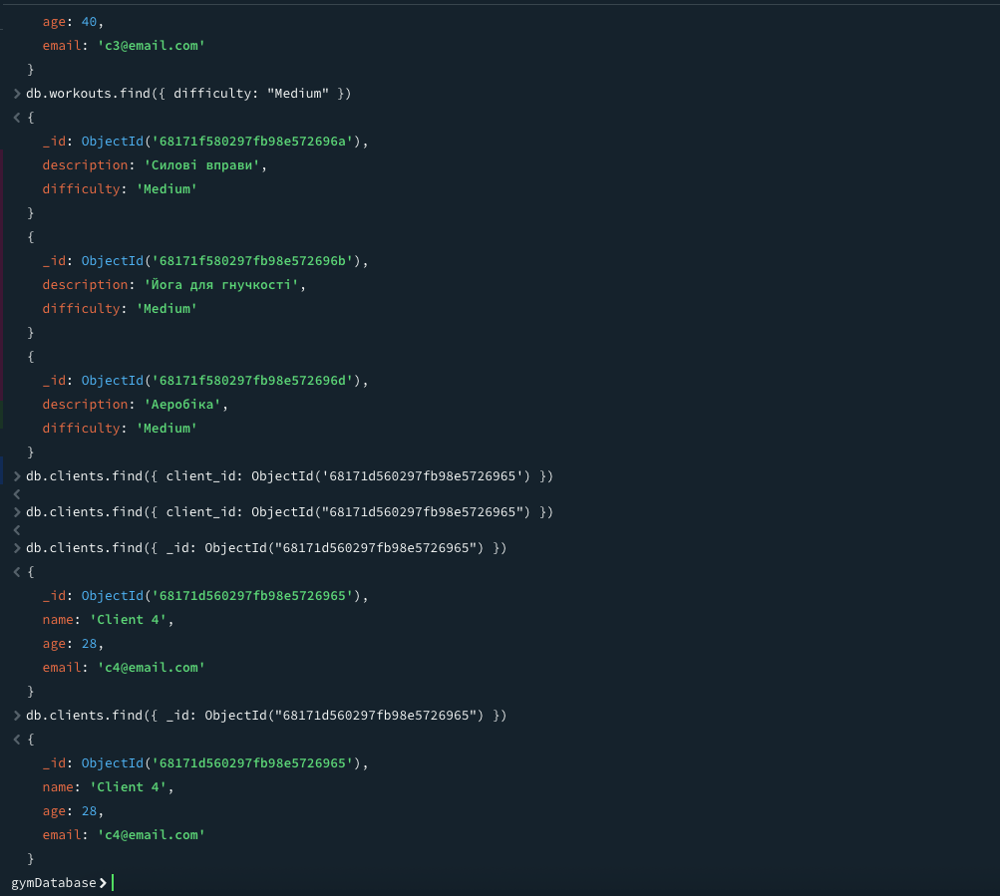
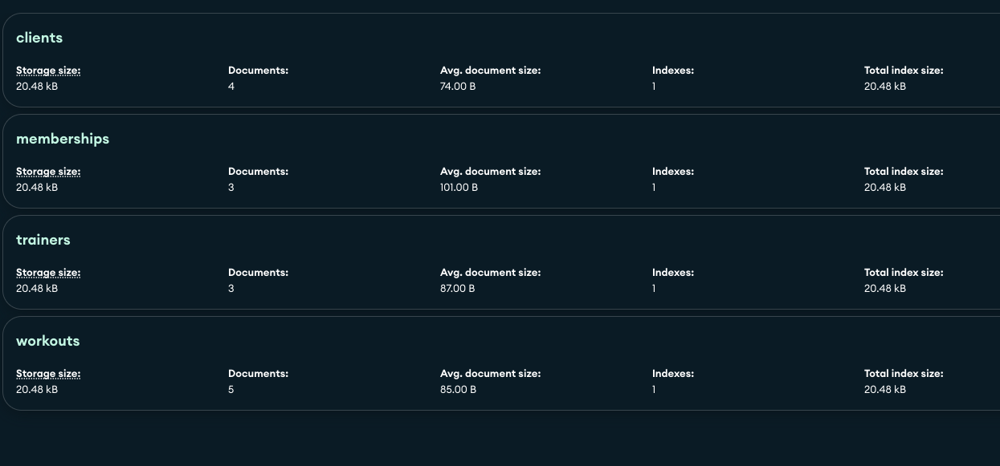
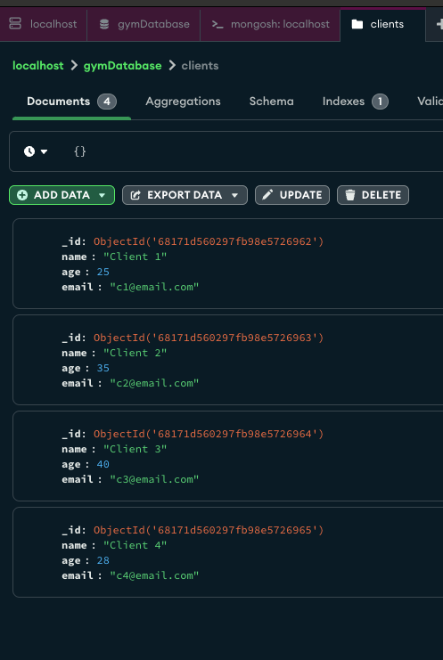
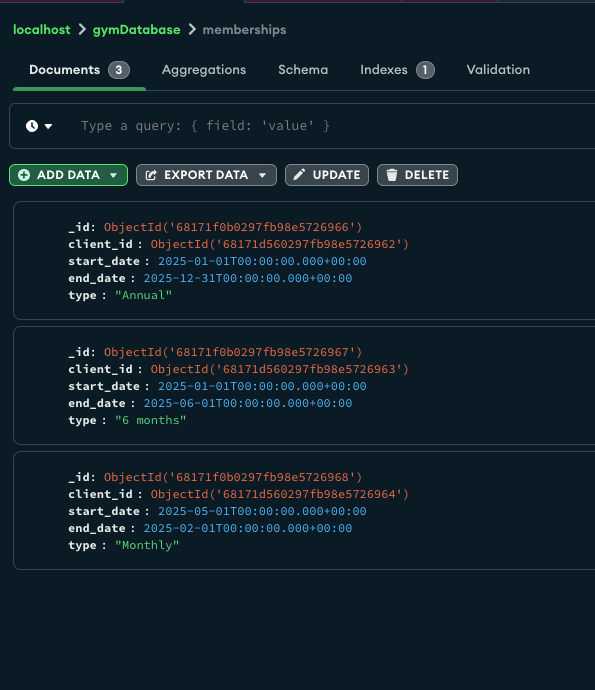
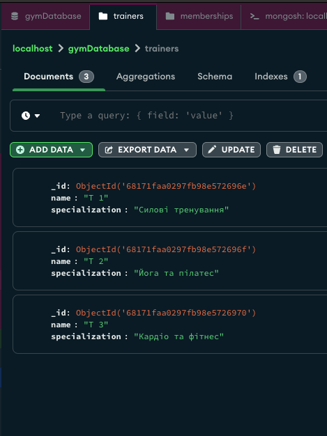
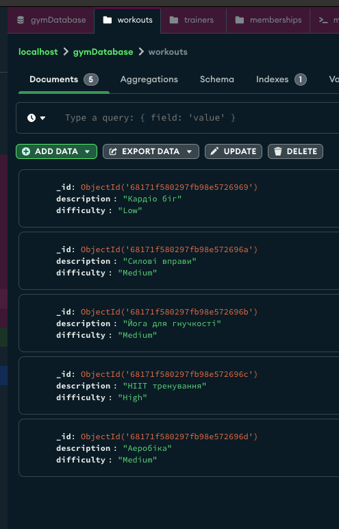

## Створення коллекцій та загрузка данних.

Підключення до бази
```
use gymDatabase;
```

**Відповідь**
```
switched to db gymDatabase
```

**Створення коллекцій**
```javascript
db.createCollection("clients")
db.createCollection("memberships")
db.createCollection("workouts")
db.createCollection("trainers")
```

**Відповідь**
```
{ ok: 1 }
```

**Додаємо кліентів**
```javascript
db.clients.insertMany([
  {
    name: "Client 1",
    age: 25,
    email: "c1@email.com"
  },
  {
    name: "Client 2",
    age: 35,
    email: "c2@email.com"
  },
  {
    name: "Client 3",
    age: 40,
    email: "c3@email.com"
  },
  {
    name: "Client 4",
    age: 28,
    email: "c4@email.com"
  }
]);
```
**Відповідь**
```javascript
{
  acknowledged: true,
  insertedIds: {
    '0': ObjectId('68171d560297fb98e5726962'),
    '1': ObjectId('68171d560297fb98e5726963'),
    '2': ObjectId('68171d560297fb98e5726964'),
    '3': ObjectId('68171d560297fb98e5726965')
  }
}
```

**Додавання членств:**

```javascript
db.memberships.insertMany([
  {
    client_id: ObjectId("68171d560297fb98e5726962"),
    start_date: ISODate("2025-01-01"),
    end_date: ISODate("2025-12-31"),
    type: "Annual"
  },
  {
    client_id: ObjectId("68171d560297fb98e5726963"),
    start_date: ISODate("2025-01-01"),
    end_date: ISODate("2025-06-01"),
    type: "6 months"
  },
  {
    client_id: ObjectId("68171d560297fb98e5726964"),
    start_date: ISODate("2025-05-01"),
    end_date: ISODate("2025-02-01"),
    type: "Monthly"
  }
])
```

**Відповідь**
```javascript
{
  acknowledged: true,
  insertedIds: {
    '0': ObjectId('68171f0b0297fb98e5726966'),
    '1': ObjectId('68171f0b0297fb98e5726967'),
    '2': ObjectId('68171f0b0297fb98e5726968')
  }
}
```

**Додавання тренувань**
```javascript
db.workouts.insertMany([
  {
    description: "Кардіо біг",
    difficulty: "Low"
  },
  {
    description: "Силові вправи",
    difficulty: "Medium"
  },
  {
    description: "Йога для гнучкості",
    difficulty: "Medium"
  },
  {
    description: "HIIT тренування",
    difficulty: "High"
  },
  {
    description: "Аеробіка",
    difficulty: "Medium"
  }
])
```

**Відповідь**
```javascript
{
  acknowledged: true,
  insertedIds: {
    '0': ObjectId('68171f580297fb98e5726969'),
    '1': ObjectId('68171f580297fb98e572696a'),
    '2': ObjectId('68171f580297fb98e572696b'),
    '3': ObjectId('68171f580297fb98e572696c'),
    '4': ObjectId('68171f580297fb98e572696d')
  }
}
```

**Додавання тренерів**
```javascript
db.trainers.insertMany([
  {
    name: "T 1",
    specialization: "Силові тренування"
  },
  {
    name: "T 2",
    specialization: "Йога та пілатес"
  },
  {
    name: "T 3",
    specialization: "Кардіо та фітнес"
  }
])
```

**Відповідь**
```javascript
{
  acknowledged: true,
  insertedIds: {
    '0': ObjectId('68171faa0297fb98e572696e'),
    '1': ObjectId('68171faa0297fb98e572696f'),
    '2': ObjectId('68171faa0297fb98e5726970')
  }
}
```

## Запити до бази данних

**Знайти всіх клієнтів віком понад 30 років**

```javascript
db.clients.find({ age: { $gt: 30 } })
```

**Відповідь**

```javascript
{
  _id: ObjectId('68171d560297fb98e5726963'),
  name: 'Client 2',
  age: 35,
  email: 'c2@email.com'
},
{
  _id: ObjectId('68171d560297fb98e5726964'),
  name: 'Client 3',
  age: 40,
  email: 'c3@email.com'
}
```

**Перелічити тренування із середньою складністю**
```javascript
db.workouts.find({ difficulty: "Medium" })
```

**Відповідь**
```javascript
{
  _id: ObjectId('68171f580297fb98e572696a'),
  description: 'Силові вправи',
  difficulty: 'Medium'
}
{
  _id: ObjectId('68171f580297fb98e572696b'),
  description: 'Йога для гнучкості',
  difficulty: 'Medium'
}
{
  _id: ObjectId('68171f580297fb98e572696d'),
  description: 'Аеробіка',
  difficulty: 'Medium'
}
```

**Показати інформацію про членство клієнта з певним client_id**
```javascript
db.clients.find({ _id: ObjectId("68171d560297fb98e5726965") })
```

**Відповідь**

```javascript
{
  _id: ObjectId('68171d560297fb98e5726965'),
  name: 'Client 4',
  age: 28,
  email: 'c4@email.com'
}
```

Скріншоти






