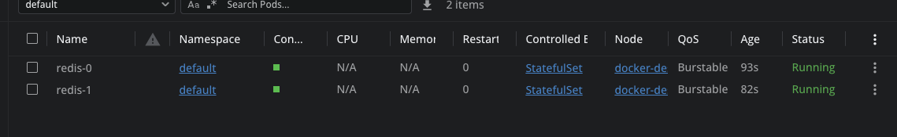

Pods:


Stateful sets:


Docker k8s containers:


Falco:


Скрипт для старта редіса

```sh
sh ./start-redis.sh
```

Скрипт для чистки всього від редіса

```sh
sh ./cleanup-redis.sh
```

Скрипт для старта фалко

```sh
sh ./start-redis.sh
```

Скрипт для чистки всього від фалко

```sh
sh ./cleanup-redis.sh
```
